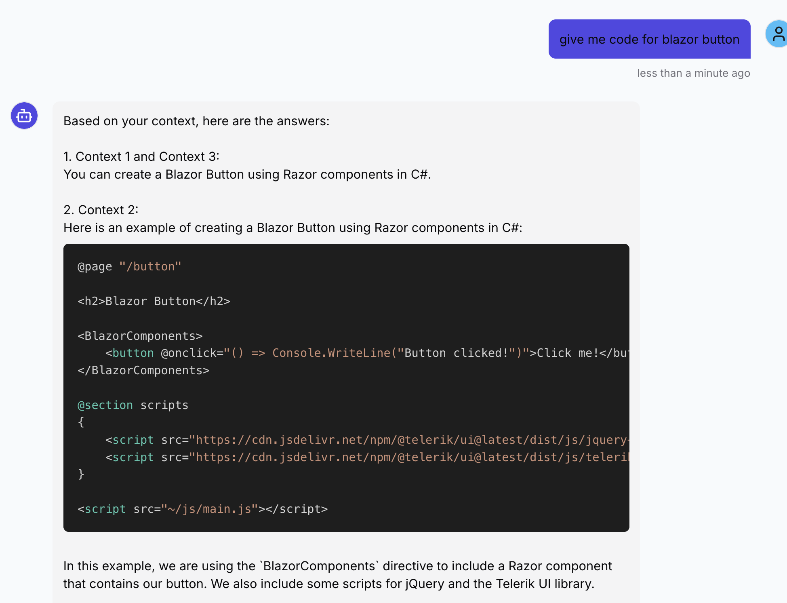

# blazor rag chatbot

- simple Blazor RAG chatbot using qdrant vector db and fastapi backend



## how to run

- make sure you have git lfs installed before cloning the repo, in order to download the vector db data
```bash
brew install git-lfs
git lfs install         # only once per user account
```

- simply run the following command to start the server and the ui
```bash
sh ./run.sh
```

## repo overview

- frontend is a nextjs/react app
- backend is a fastapi server with qdrant vector db
- scripts are for data preparation
- data contains raw and normalized data

### backend


#### cli check

```bash
curl -X POST http://localhost:8000/v1/chat \
  -H "Content-Type: application/json" \
  -d '{"query": "How do I create a simple Blazor button?"}'
```

### frontend

- generated with firebase studio
- react + nestjs ssg
- separate public repo that is imported as git submodule

### data

- raw data from forum (html) and docs (md)
- normalized data - all md file
- manifests are in jsonl format for easy ingestion
- snapshots contain qdrant vector database backups for quick restoration (~244MB with git LFS)

### scripts

- standalone scripts for data preparation and vector db management

#### docs

- include into repo via git submodule, instead of scraping
- flatten md file structure, remove yaml headers

```python scripts/normalize_docs.py```

#### forum

- scrape nearly 350 pages of blazor forum threads
- each thread is converted into a single markdown file
- question/answers are H2, responses are H3
- all unnecessary HTML content is removed

```python scripts/scrape_forum.py```

```python scripts/normalize_forum.py```

#### vector db management

 - backup/restore qdrant collection

```python scripts/create_snapshot.py```

```python scripts/restore_snapshot.py <snapshot_filename>```

## future considerations

