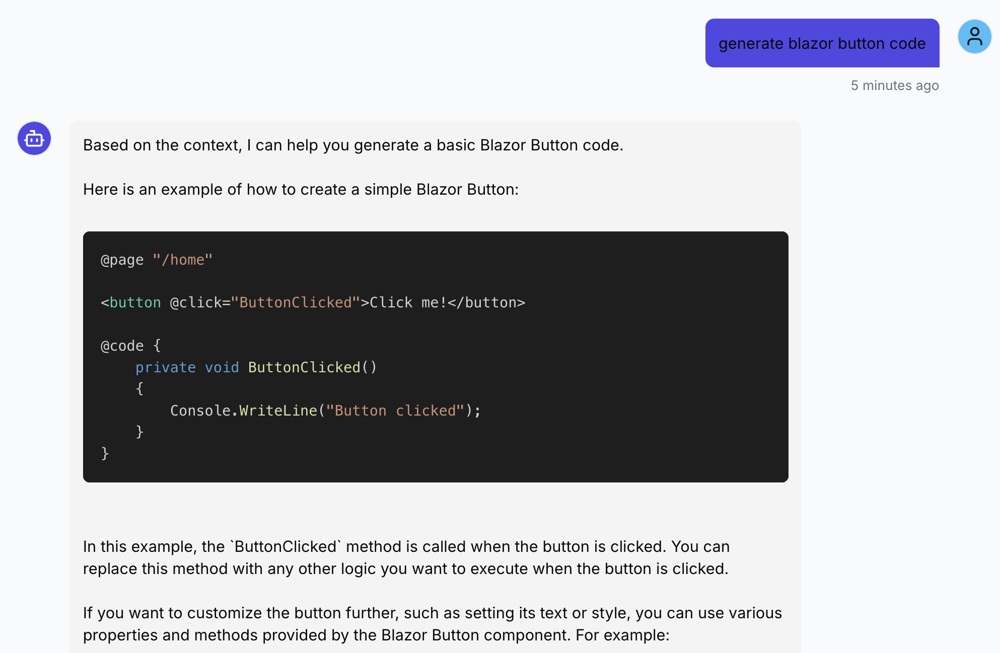

# blazor rag chatbot

- simple Blazor RAG chatbot using qdrant vector db and fastapi backend



## how to run

- make sure you have git lfs installed before cloning the repo, in order to download the vector db data
```bash
brew install git-lfs
git lfs install         # only once per user account
```

- clone the repo (might take up to 30 seconds to download the lfs data)
```bash
git clone https://github.com/cleverjobs/blazor-rag.git
cd blazor-rag
```

- simply run the following command to download all missing dependencies (e.g. llm) and start all containers (takes about 3 minutes on an M1 Mac with 32GB RAM)
```bash
sh ./run.sh
```

- open [http://localhost:3000](http://localhost:3000) in your browser to access the frontend
- enter a simple question like **"generate blazor button code"** and hit enter

## repo overview

- frontend is a nextjs/react app
- backend is a fastapi server with qdrant vector db
- scripts are for data preparation
- data contains raw and normalized data

### backend

the backend processes user queries by:
1. retrieving relevant context from qdrant vector database
2. generating responses using ollama's llama3.2 model
3. returning contextual answers via fastapi endpoints

#### tech stack

- **fastapi** - rest api server for chat endpoints
- **qdrant** - vector database for semantic search
- **ollama** - local llm inference (llama3.2 model)
- **docker** - containerized deployment with health checks

#### dev process

development workflow involves data ingestion that takes ~1 hour:

1. **prepare data** - normalize docs and forum content into markdown manifests
2. **run ingest-worker** - processes manifests using `sentence-transformers/all-minilm-l6-v2` embeddings
3. **populate qdrant** - chunks text (400 tokens, 50 overlap) and stores vectors in database
4. **create snapshot** - backup qdrant collection for staging deployment

staging uses pre-built snapshot restoration to avoid computation time:
- `docker-compose.dev.yml` - full ingestion pipeline for development
- `docker-compose.stage.yml` - restores from snapshot for quick deployment

#### cli check

```bash
curl -x post http://localhost:8000/v1/chat \
  -h "content-type: application/json" \
  -d '{"query": "how do i create a simple blazor button?"}'
```

### frontend

- generated with firebase studio
- react + nestjs ssg
- separate public repo that is imported as git submodule

### data

- raw data from forum (html) and docs (md)
- normalized data - all md file
- manifests are in jsonl format for easy ingestion
- snapshots contain qdrant vector database backups for quick restoration (~244MB with git LFS)

### scripts

- standalone scripts for data preparation and vector db management

#### docs

- include into repo via git submodule, instead of scraping
- flatten md file structure, remove yaml headers

```python scripts/normalize_docs.py```

#### forum

- scrape nearly 350 pages of blazor forum threads
- each thread is converted into a single markdown file
- question/answers are H2, responses are H3
- all unnecessary HTML content is removed

```python scripts/scrape_forum.py```

```python scripts/normalize_forum.py```

#### vector db management

 - backup/restore qdrant collection

```python scripts/create_snapshot.py```

```python scripts/restore_snapshot.py <snapshot_filename>```

## future considerations

### cost efficiency
- **hybrid retrieval** - combine vector search with keyword matching to reduce llm calls
- **response caching** - store common query responses to minimize computation
- **smaller models** - evaluate phi-3 or other efficient models vs llama3.2

### accuracy improvements
- **query rewriting** - preprocess user queries for better semantic matching
- **feedback loop** - collect user ratings to fine-tune responses
- **context filtering** - remove outdated or irrelevant documentation

### scalability & usability
- **multi-tenant** - support multiple product lines (kendo blazor, kendo angular, etc.)
- **conversation memory** - maintain chat history for contextual follow-ups
- **code execution** - integrate sandboxed environment for runnable examples

